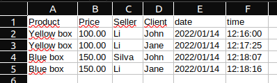

# Generating a report in CSV format and sending it to a email



## How to start project.

- Create a folder in your machine
- Create a virtual environment
    - python3 -m venv venv
- Start the virtual environment
    - ```. venv/bin/activate``` (Linux)
    - ``venv/Scripts/Activate`` (Windows)
- Inside your venv folder clone the project
    - ```git clone https://github.com/alexlopesbr/forgot-password.git```
- In your-new-folder/venv/forgot-password
    - ```pip install -r requirements.txt``` to install the project's dependencies
    - ```python manage.py migrate``` to generate your database
    - ```python3 manage.py createsuperuser``` to create the admin
    - ```python3 manage.py runserver``` to start the server
- Open your browser and go to http://127.0.0.1:8000/admin/
- Login with the admin credentials
    - Now you can see you user and some info in admin panel

## Using the functionality

POST ```{{localhost}}/core/log-generator```

> body of the request:

    {
        "product_id": 1,
        "seller_id": 4,
        "date_from": "2021-01-14",
        "date_to": "2021-01-14"
    }

>header: Must be passed the key ```Authorization``` and the value ```Token <token>```
---
> You can pass the following parameters to filter your results, note that all parameters are optional and in this case you will get all the logs:
>
> If you pass only **date_from**, you will get the logs from that date.
>
> If you pass both **date_from** and **date_to**, you will get the logs between those dates.

> You can use [Postman](https://www.postman.com/) or [Insomnia](https://insomnia.rest/) to test the requests.<br>
> **Note:** When you start your server the localhost generaly is http://127.0.0.1:8000/.
---


# Some instructions and informations

## root
### setings.py
~~~python
BASE_DIR = os.path.dirname(os.path.dirname(os.path.abspath(__file__)))

BASE_URL = 'sandbox.com'

EMAIL_BACKEND = 'django.core.mail.backends.smtp.EmailBackend'
EMAIL_HOST = 'smtp.gmail.com'
EMAIL_HOST_USER = 'email@email.com'
EMAIL_HOST_PASSWORD = 'your-key'
EMAIL_PORT = 587
EMAIL_USE_TLS = True
~~~
> First step, set some configures in settings.py.
> Don't forget to set the EMAIL_HOST_USER and the EMAIL_HOST_PASSWORD.
---

## core

### models.py
~~~python
class ProductSold(models.Model):
    product = models.ForeignKey(Product, on_delete=models.CASCADE)
    seller = models.ForeignKey(Seller, on_delete=models.CASCADE)
    client = models.ForeignKey(Client, on_delete=models.CASCADE)
    created_at = models.DateTimeField(auto_now_add=True)
    updated_at = models.DateTimeField(auto_now=True)

    def __str__(self):
        return '{} - {} - {}'.format(self.product.name, self.seller.user.email, self.client.user.email)
~~~

>  This model will be the base of the CSV file

### views.py
~~~python
@csrf_exempt
@api_view(['POST'])
@permission_classes([IsAdminUser])
def log_generator_view(request):
    return Response(log_generator(request))
~~~
> This function view will generate the CSV file with the data from the request, look his ulr bellow.

### urls.py
~~~python
router = DefaultRouter()
router.register(r'user', UserViewSet)
router.register(r'client', ClientViewSet)
router.register(r'seller', SellerViewSet)
router.register(r'product', ProductViewSet)
router.register(r'product-sold', ProductSoldViewSet)

urlpatterns = [
    path('auth/', CustomAuthToken.as_view()),
    path('', include(router.urls)),
    url(r'^log-generator/?$', log_generator_view),

]
~~~
> Just pay attention to the url of the **log-generator**, it will be used to generate the CSV file.


### services.py
~~~python
from django.core.mail import EmailMessage
from django.conf import settings

import io
import csv

from .models import ProductSold

def log_generator(request):
    email = request.user.email
    data = request.data

    product_id = data.get('product_id', None)
    seller = data.get('seller', None)
    date_from = data.get('date_from', None)
    date_to = data.get('date_to', None)

    producs_sold = ProductSold.objects.all()

    if product_id:
        producs_sold = producs_sold.filter(product__id=product_id)

    if seller:
        producs_sold = producs_sold.filter(seller__id=seller)

    if date_from:
        producs_sold = producs_sold.filter(created_at__exact=date_from)

    if date_from and date_to:
        producs_sold = producs_sold.filter(created_at__range=[date_from, date_to])

    create_log_report(producs_sold, email)


def create_log_report(producs_sold, email):
    filename = 'report.csv'

    data = io.StringIO()
    spamwriter = csv.writer(data)
    spamwriter.writerow(('Product', 'Price', 'Seller', 'Client', 'date', 'time'))

    for product_sold in producs_sold:
        Product = product_sold.product.name
        Price = product_sold.product.price
        Seller = product_sold.seller.user.name
        Client = product_sold.client.user.name
        date = product_sold.created_at.strftime("%Y/%m/%d")
        time = product_sold.created_at.strftime("%H:%M:%S")

        spamwriter.writerow((Product, Price, Seller, Client, date, time))

    if email:
        send_email_report(email, data.getvalue(), filename)


def send_email_report(email, report, file):
    msg = EmailMessage(
        u'Logs',
        '<br>Products sold: <br>',
        to=[email, ],
        from_email=settings.EMAIL_HOST_USER,
        attachments=[(file, report)]
    )
    msg.content_subtype = 'html'
    msg.send()

~~~
> The first function **log_generator** will take the parameters of the request that will serve as a basis for generating the log.

> The second function **create_log_report** will create the CSV file. Note the **spamwriter.writerow**, to set the columns of the CSV file.

> The last function **send_email_report** will send the email (logged in person's email) with the CSV file attached.

---

> More information about sending emails in [Sending email - Django documentation](https://docs.djangoproject.com/en/3.2/topics/email/)
>
> More information about CSV files in [How to create CSV output - Django documentation](https://docs.djangoproject.com/en/4.0/howto/outputting-csv/)
